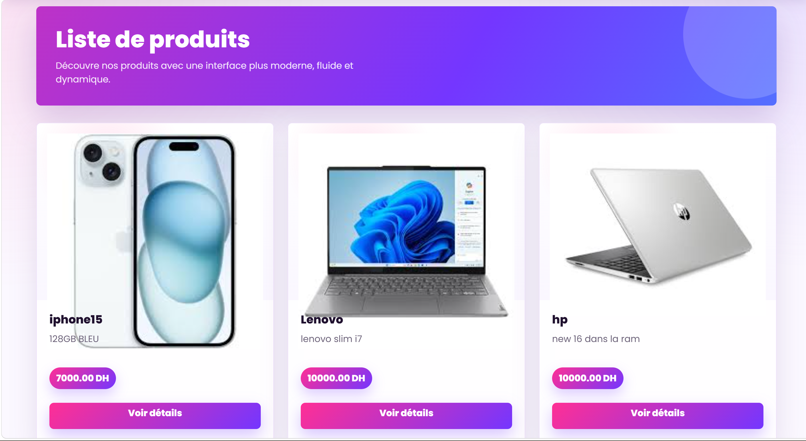
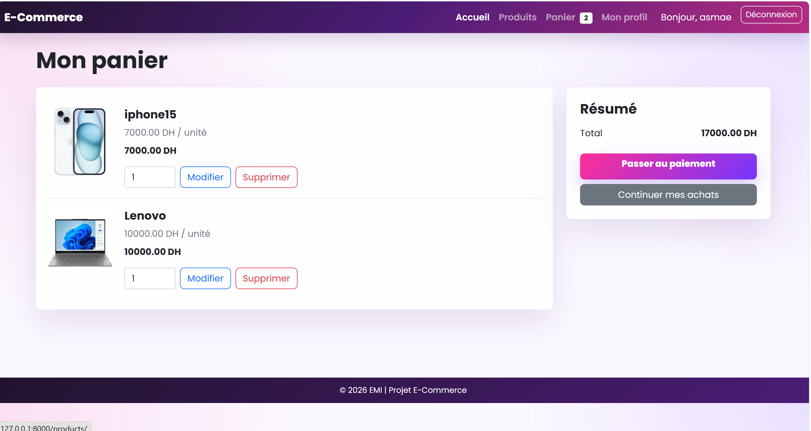
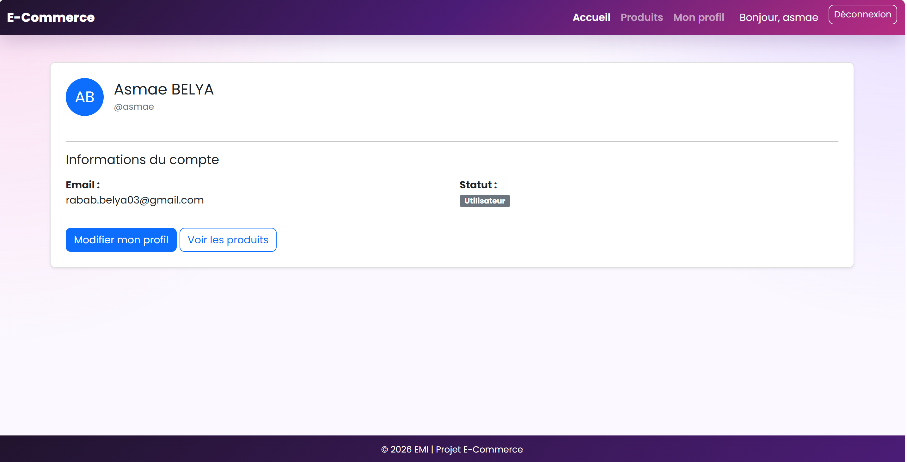
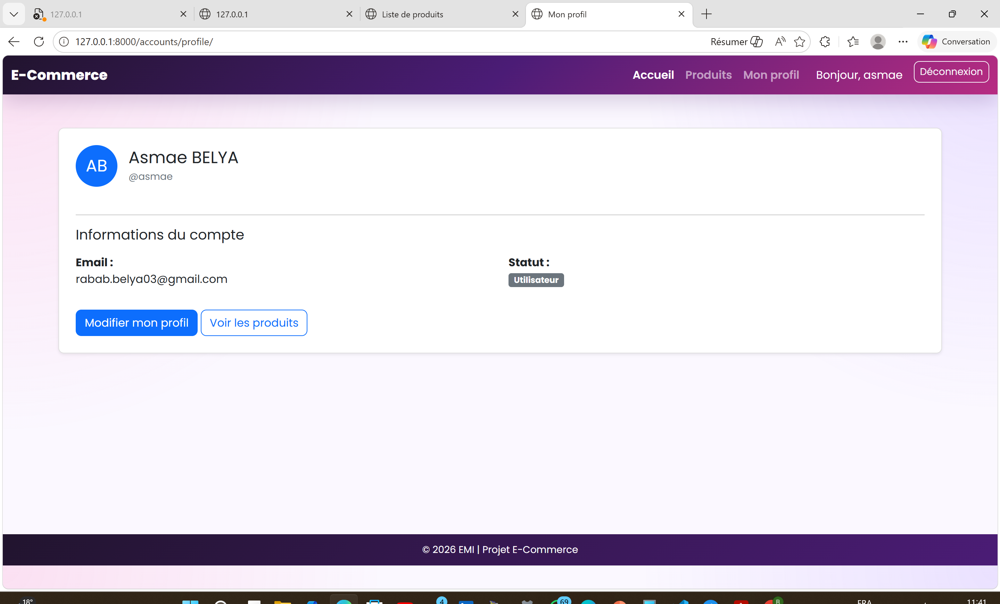
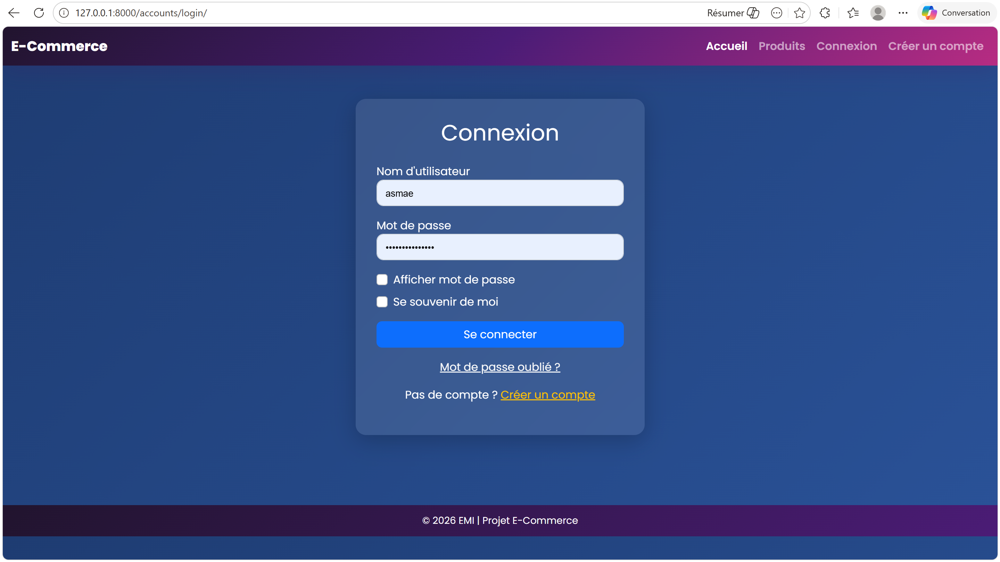
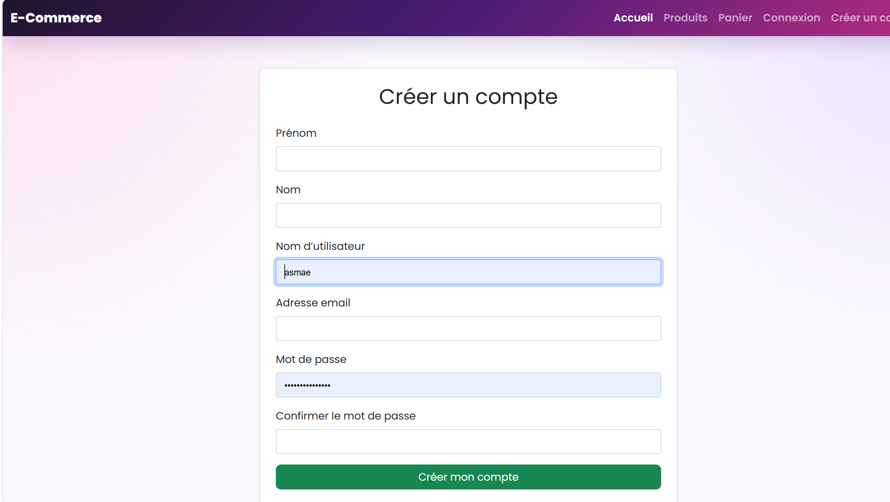
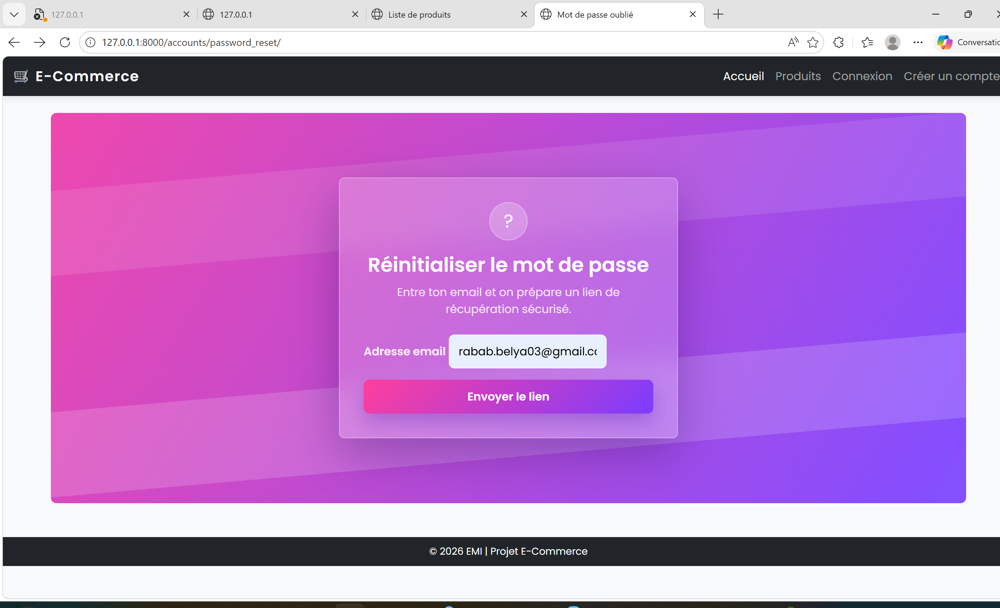

# Ecommerce Project 2

Projet e-commerce realise avec Django.

## Technologies

- Python
- Django
- SQLite
- Bootstrap

## Fonctionnalites

- Liste des produits
- Detail d'un produit
- Authentification utilisateur
- Profil utilisateur
- Modification du profil
- Reinitialisation du mot de passe
- Panier
- Checkout avec paiement simule
- Commandes en base de donnees
- Images des produits

## Captures d'ecran

### Page produits



### Panier



### Profil utilisateur



### Profil utilisateur connecte



### Connexion



### Creation de compte



### Reinitialisation du mot de passe



## Installation

Cloner le projet :

```powershell
git clone https://github.com/89DJUD/ecommerce_project2.git
cd ecommerce_project2
```

Creer et activer un environnement virtuel :

```powershell
python -m venv .venv
.\.venv\Scripts\Activate.ps1
```

Installer les dependances :

```powershell
pip install django pillow
```

## Lancer le projet

Aller dans le dossier Django :

```powershell
cd ecommerce
```

Appliquer les migrations :

```powershell
python manage.py migrate
```

Lancer le serveur :

```powershell
python manage.py runserver
```

Ouvrir ensuite :

```text
http://127.0.0.1:8000/products/
```

## Auteur

89DJUD
